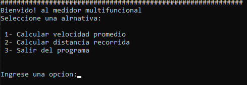
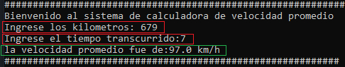
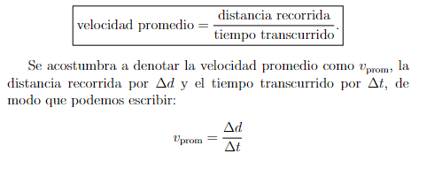
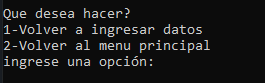
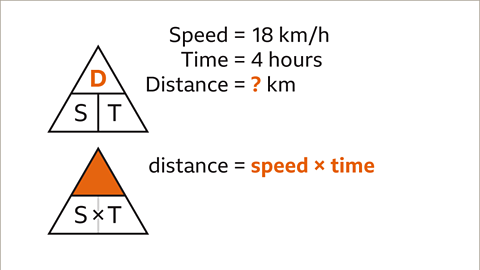

# Velocidad Promedio / Distancia Recorrida

### este es un programa de consola, que ofrece realizar operaciones matematicas relaciónadas con la medición de distancias. (permite calcular la velocidad promedio y la distancia recorrida).

#### las operaciónes matematicas fueron sacadas del libro "Elementos de cálculo diferencial volumen 1 limites y la derivada" by: Ángel Ruiz / hugo barrantes

## CAPTURAS DEL PROGRAMA

### 1.1 primera parte del programa 
#### en esta primera parte se le da la bienvenida al programa y se le solicita al usuario  que ingrese una opción en base a su interes

### 1.2 primera opción (Velocidad Promedio)
#### si el usuario ingreso la primera opción se le dara la bienvenida al modo de calculo velocidad promedio, donde se le pedira que ingrese la cantidad de kilometros recorridos y ademas la cantidad de horas que se recorrieron.

### la formula matematica: 

### luego de que se muestre el resultado de la operación matematica, se le vuelve a pedir al usuario que ingrese una opción pero esta vez si quiere volver a ingresar datos en el calculo actual (velocidad promedio) o si desea volver al menu principal para ingresar a otro cálculo 

### 1.3 segunda opción (Distancia Recorrida)
#### si el usuario ingreso la segunda opción (en el primer menu) se le dara la bienvenida al modo de cálculo de distancia recorrida, donde se le pedira que ingrese la cantidad de kilometros por hora  y ademas la cantidad de tiempo que se estimo recorrer.

### la formula matematica:

